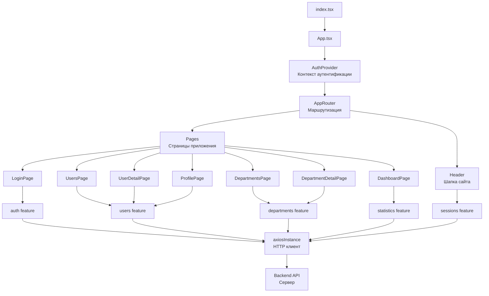
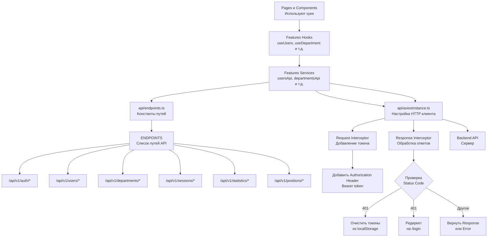

# Диаграммы проекта WorklyFrontend

## 1. Архитектурная диаграмма приложения

```mermaid
flowchart TD
    Start[index.tsx] --> App[App.tsx]
    
    App --> Auth[AuthProvider<br/>Контекст аутентификации]
    
    Auth --> Router[AppRouter<br/>Маршрутизация]
    
    Router --> Header[Header<br/>Шапка сайта]
    Router --> Pages[Pages<br/>Страницы приложения]
    
    Pages --> Login[LoginPage]
    Pages --> Users[UsersPage]
    Pages --> UserDetail[UserDetailPage]
    Pages --> Departments[DepartmentsPage]
    Pages --> DepartmentDetail[DepartmentDetailPage]
    Pages --> Profile[ProfilePage]
    Pages --> Dashboard[DashboardPage]
    
    Login --> AuthFeature[auth feature]
    Users --> UsersFeature[users feature]
    UserDetail --> UsersFeature
    Departments --> DepartmentsFeature[departments feature]
    DepartmentDetail --> DepartmentsFeature
    Profile --> UsersFeature
    Dashboard --> StatisticsFeature[statistics feature]
    Header --> SessionsFeature[sessions feature]
    
    AuthFeature --> API[axiosInstance<br/>HTTP клиент]
    UsersFeature --> API
    DepartmentsFeature --> API
    StatisticsFeature --> API
    SessionsFeature --> API
    
    API --> Backend[Backend API<br/>Сервер]
    
```

## 2. Структура API слоя

```mermaid
flowchart TD
    Top[Pages и Components<br/>Используют хуки]
    
    Top --> Hooks[Features Hooks<br/>useUsers, useDepartment и т.д.]
    
    Hooks --> Services[Features Services<br/>usersApi, departmentsApi и т.д.]
    
    Services --> EndpointsFile[api/endpoints.ts<br/>Константы путей]
    Services --> AxiosFile[api/axiosInstance.ts<br/>Настройка HTTP клиента]
    
    EndpointsFile --> EndpointsList[ENDPOINTS<br/>Список путей API]
    
    EndpointsList --> AuthPath["/api/v1/auth/*"]
    EndpointsList --> UsersPath["/api/v1/users/*"]
    EndpointsList --> DepartmentsPath["/api/v1/departments/*"]
    EndpointsList --> SessionsPath["/api/v1/sessions/*"]
    EndpointsList --> StatisticsPath["/api/v1/statistics/*"]
    EndpointsList --> PositionsPath["/api/v1/positions/*"]
    
    AxiosFile --> RequestInt[Request Interceptor<br/>Добавление токена]
    AxiosFile --> ResponseInt[Response Interceptor<br/>Обработка ответов]
    
    RequestInt --> AddToken[Добавить Authorization Header<br/>Bearer token]
    
    ResponseInt --> CheckStatus{Проверка<br/>Status Code}
    
    CheckStatus -->|401| ClearTokens[Очистить токены<br/>из localStorage]
    CheckStatus -->|401| Redirect[Редирект<br/>на /login]
    CheckStatus -->|Другое| ReturnData[Вернуть Response<br/>или Error]
    
    Services --> AxiosFile
    AxiosFile --> Backend[Backend API<br/>Сервер]

```